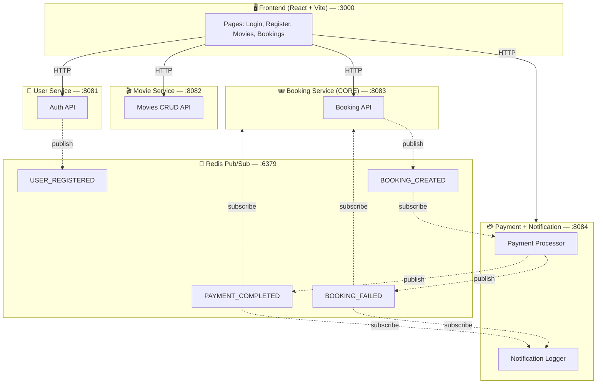

# 🎬 CineTicket: Event-Driven Movie Ticket Booking System

A scalable, event-driven microservices application built with **Node.js, Express, React, and Redis Pub/Sub**. This system demonstrates asynchronous communication between decoupled services to handle movie ticket bookings, simulated payment processing, and user notifications.

---

## 🏗️ Architecture

The application is composed of 4 backend microservices and 1 frontend UI. They communicate asynchronously via **Redis Pub/Sub**. 

Services **never** call each other directly over HTTP.

### System Diagram



---

## 🛠️ Technology Stack

| Component | Technology | Description |
|:---|:---|:---|
| **Frontend** | React, Vite | Modern, fast UI with dynamic polling for status updates. |
| **Backend API** | Node.js, Express.js | Lightweight HTTP servers for each microservice. |
| **Message Broker** | Redis Pub/Sub | Handles asynchronous events between services. |
| **Database** | SQLite, Sequelize | Each service has its own isolated `.sqlite` database file. |
| **Authentication** | JWT, bcrypt | Stateless JSON Web Tokens for securing API endpoints. |

---

## 📦 Services Breakdown

1. **User Service (Port 8081)**
   - Manages user registration and JWT authentication.
   - Publishes `USER_REGISTERED` when a new account is created.

2. **Movie Service (Port 8082)**
   - Simple RESTful CRUD service for managing movies.
   - Automatically seeds the database with 6 sample movies on startup.

3. **Booking Service (CORE) (Port 8083)**
   - Exposes APIs to create and retrieve bookings.
   - When a booking is created, it saves as `PENDING` and publishes `BOOKING_CREATED`.
   - Listens for `PAYMENT_COMPLETED` and `BOOKING_FAILED` to update the booking status.

4. **Payment & Notification Service (Port 8084)**
   - Purely event-driven backend service.
   - Listens for `BOOKING_CREATED` events.
   - Simulates a payment delay (1-3s) with a 70% success rate.
   - Publishes `PAYMENT_COMPLETED` or `BOOKING_FAILED`.
   - Listens to its own payment events to log notifications.

---

## 🚀 Getting Started

### Prerequisites
- [Node.js](https://nodejs.org/) (v16 or higher)
- [Docker Desktop](https://www.docker.com/products/docker-desktop/) (Required to run Redis)

### 1. Start Redis Message Broker
```bash
docker run -d --name redis-movie-ticket -p 6379:6379 redis:alpine
```

### 2. Install Dependencies
Run `npm install` inside the following 5 folders:
- `/user-service`
- `/movie-service`
- `/booking-service`
- `/payment-service`
- `/frontend`

### 3. Start the Backend Services
Open 4 separate terminals, navigate to each service folder, and start them:
```bash
# Terminal 1
cd user-service && npm start

# Terminal 2 
cd movie-service && npm start

# Terminal 3
cd booking-service && npm start

# Terminal 4
cd payment-service && npm start
```

### 4. Start the Frontend
Open a 5th terminal and start the React application:
```bash
cd frontend
npm run dev
```

### 5. Test the Demo Flow
Open [http://localhost:3000](http://localhost:3000) in your browser:
1. **Sign Up** for a new account.
2. Browse the **Movies** page and select a movie.
3. Choose a seat and click **Confirm Booking**.
4. Go to the **My Bookings** tab. You will initially see the status as `PENDING`.
5. Wait ~3 seconds. The status will automatically poll and update to `CONFIRMED` or `FAILED` as the backend events resolve!

---

## 🔒 Security & Data Isolation
- **No Shared Databases**: `users.sqlite`, `movies.sqlite`, and `bookings.sqlite` are completely isolated.
- **JWT Authorization**: Frontend passes Bearer tokens to access protected routes (like booking a ticket).
- **Asynchronous Decoupling**: If the Payment Service goes down, the Booking Service can still create `PENDING` bookings without crashing.
