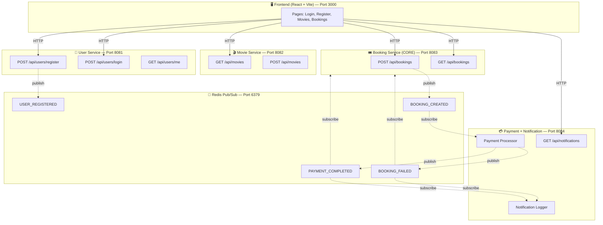
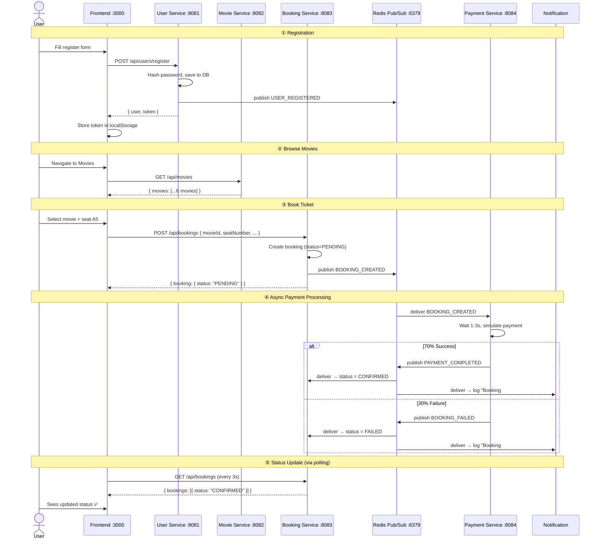

# 🎬 Movie Ticket System — Full System Walkthrough

## Overview

This is an **Event-Driven Architecture** demo where 4 backend microservices communicate asynchronously through **Redis Pub/Sub** (the message broker). Services **never call each other directly** — they publish and subscribe to events.

---

## Architecture Diagram



> **Solid arrows** = HTTP API calls from frontend  
> **Dashed arrows** = Async event flow via Redis Pub/Sub

---

## Project Structure

```
tuan7/
├── user-service/          👤 Port 8081 — Register & Login
├── movie-service/         🎬 Port 8082 — CRUD Movies
├── booking-service/       🎟️ Port 8083 — Create & Track Bookings (CORE)
├── payment-service/       💳 Port 8084 — Payment + Notifications
└── frontend/              🖥️ Port 3000 — React UI
```

---

## Service-by-Service Breakdown

---

### 1. 👤 User Service (Port 8081)

> **Role:** Handles user registration and authentication. Publishes `USER_REGISTERED` event.

**Files:**
| File | Purpose |
|:---|:---|
| [index.js](file:///c:/Users/Admin/Desktop/ktpm%20-%20exercises/tuan7/user-service/src/index.js) | Express app entry — starts server, syncs SQLite DB |
| [user.model.js](file:///c:/Users/Admin/Desktop/ktpm%20-%20exercises/tuan7/user-service/src/models/user.model.js) | Sequelize model: `id`, `username`, `email`, `password` (bcrypt hash), `role` |
| [user.controller.js](file:///c:/Users/Admin/Desktop/ktpm%20-%20exercises/tuan7/user-service/src/controllers/user.controller.js) | Business logic for register, login, getProfile |
| [user.routes.js](file:///c:/Users/Admin/Desktop/ktpm%20-%20exercises/tuan7/user-service/src/routes/user.routes.js) | Route definitions |
| [auth.js](file:///c:/Users/Admin/Desktop/ktpm%20-%20exercises/tuan7/user-service/src/middleware/auth.js) | JWT verification middleware |
| [redis.js](file:///c:/Users/Admin/Desktop/ktpm%20-%20exercises/tuan7/user-service/src/config/redis.js) | Redis publisher — `publishEvent(channel, data)` |
| [db.js](file:///c:/Users/Admin/Desktop/ktpm%20-%20exercises/tuan7/user-service/src/config/db.js) | SQLite connection via Sequelize |

**API Endpoints:**
```
POST /api/users/register  →  Creates user + hashes password + returns JWT + publishes USER_REGISTERED
POST /api/users/login     →  Validates credentials + returns JWT
GET  /api/users/me        →  Returns current user profile (requires JWT)
```

**Event Published:**
```json
// Channel: USER_REGISTERED
{
  "event": "USER_REGISTERED",
  "data": { "userId": 1, "username": "john_doe", "email": "john@example.com" },
  "timestamp": "2026-04-25T12:00:00Z"
}
```

**How registration works (step by step):**
1. Frontend sends `POST /api/users/register` with `{ username, email, password }`
2. Controller checks for duplicate username/email
3. Password is hashed with `bcrypt` (10 salt rounds)
4. User is saved to `users.sqlite`
5. JWT token is generated (expires in 24h) containing `{ id, username, email, role }`
6. `USER_REGISTERED` event is published to Redis
7. Response returned: `{ user, token }`

---

### 2. 🎬 Movie Service (Port 8082)

> **Role:** Simple CRUD for movies. No events. Seeds 6 movies on first startup.

**Files:**
| File | Purpose |
|:---|:---|
| [index.js](file:///c:/Users/Admin/Desktop/ktpm%20-%20exercises/tuan7/movie-service/src/index.js) | Entry point — syncs DB + seeds movies |
| [movie.model.js](file:///c:/Users/Admin/Desktop/ktpm%20-%20exercises/tuan7/movie-service/src/models/movie.model.js) | Model: `title`, `description`, `genre`, `duration`, `price`, `posterUrl`, `showtime`, `totalSeats` |
| [movie.controller.js](file:///c:/Users/Admin/Desktop/ktpm%20-%20exercises/tuan7/movie-service/src/controllers/movie.controller.js) | CRUD operations |
| [seed.js](file:///c:/Users/Admin/Desktop/ktpm%20-%20exercises/tuan7/movie-service/src/seed/seed.js) | Seeds 6 movies (Inception, Dark Knight, Interstellar, Parasite, Spider-Man, Dune) |

**API Endpoints:**
```
GET  /api/movies      →  List all movies (public)
GET  /api/movies/:id  →  Get one movie (public)
POST /api/movies      →  Create movie (requires JWT)
PUT  /api/movies/:id  →  Update movie (requires JWT)
```

> [!NOTE]
> This is the simplest service — no Redis, no events. It's pure REST CRUD with a SQLite database that auto-seeds on first run.

---

### 3. 🎟️ Booking Service — CORE (Port 8083)

> **Role:** Creates bookings and publishes `BOOKING_CREATED`. Listens for payment results to update booking status. **Never processes payments directly.**

**Files:**
| File | Purpose |
|:---|:---|
| [index.js](file:///c:/Users/Admin/Desktop/ktpm%20-%20exercises/tuan7/booking-service/src/index.js) | Entry point — syncs DB + sets up event listeners |
| [booking.model.js](file:///c:/Users/Admin/Desktop/ktpm%20-%20exercises/tuan7/booking-service/src/models/booking.model.js) | Model: `userId`, `username`, `movieId`, `movieTitle`, `seatNumber`, `amount`, `status` |
| [booking.controller.js](file:///c:/Users/Admin/Desktop/ktpm%20-%20exercises/tuan7/booking-service/src/controllers/booking.controller.js) | Create booking + publish event |
| [subscriber.js](file:///c:/Users/Admin/Desktop/ktpm%20-%20exercises/tuan7/booking-service/src/events/subscriber.js) | Listens for `PAYMENT_COMPLETED` and `BOOKING_FAILED` |
| [redis.js](file:///c:/Users/Admin/Desktop/ktpm%20-%20exercises/tuan7/booking-service/src/config/redis.js) | Redis pub + sub connections |

**API Endpoints:**
```
POST /api/bookings      →  Create booking (PENDING) + publish BOOKING_CREATED
GET  /api/bookings      →  List current user's bookings
GET  /api/bookings/:id  →  Get single booking
```

**Event Published:**
```json
// Channel: BOOKING_CREATED
{
  "event": "BOOKING_CREATED",
  "data": {
    "bookingId": 1, "userId": 1, "username": "john_doe",
    "movieId": 3, "movieTitle": "Interstellar",
    "seatNumber": "A5", "amount": 130000, "status": "PENDING"
  }
}
```

**Events Subscribed:**
| Event | Action |
|:---|:---|
| `PAYMENT_COMPLETED` | Update booking status → `CONFIRMED` |
| `BOOKING_FAILED` | Update booking status → `FAILED` |

**How booking works:**
1. Frontend sends `POST /api/bookings` with `{ movieId, movieTitle, seatNumber, amount }`
2. Booking is created in `bookings.sqlite` with status = `PENDING`
3. `BOOKING_CREATED` event is published to Redis
4. Response returns immediately with the `PENDING` booking
5. *(Asynchronously)* Payment Service picks up the event and processes it
6. *(Asynchronously)* When payment result comes back via Redis, the subscriber updates the status

> [!IMPORTANT]
> This is the **core architectural principle** — the Booking Service publishes an event and returns immediately. It does NOT wait for payment. The status updates asynchronously via Redis events.

---

### 4. 💳 Payment + Notification Service (Port 8084)

> **Role:** Subscribes to `BOOKING_CREATED`, simulates payment (70% success), publishes result, and logs notifications.

**Files:**
| File | Purpose |
|:---|:---|
| [index.js](file:///c:/Users/Admin/Desktop/ktpm%20-%20exercises/tuan7/payment-service/src/index.js) | Entry point — sets up 3 Redis subscriptions |
| [payment.service.js](file:///c:/Users/Admin/Desktop/ktpm%20-%20exercises/tuan7/payment-service/src/services/payment.service.js) | Simulates payment with random success/failure |
| [notification.service.js](file:///c:/Users/Admin/Desktop/ktpm%20-%20exercises/tuan7/payment-service/src/services/notification.service.js) | Logs notifications to console + stores in memory array |
| [redis.js](file:///c:/Users/Admin/Desktop/ktpm%20-%20exercises/tuan7/payment-service/src/config/redis.js) | Redis pub + sub connections |

**Event Subscriptions:**
| Event Received | Action |
|:---|:---|
| `BOOKING_CREATED` | → Process payment → publish result |
| `PAYMENT_COMPLETED` | → Log success notification |
| `BOOKING_FAILED` | → Log failure notification |

**Payment Simulation:**
```
1. Receive BOOKING_CREATED event
2. Wait 1-3 seconds (simulated processing)
3. Random outcome: 70% success / 30% failure
4. If success → publish PAYMENT_COMPLETED (with transactionId)
5. If failure → publish BOOKING_FAILED (with reason)
```

**Notification Output (in terminal):**
```
🔔 ════════════════════════════════════════
🔔 NOTIFICATION: BOOKING CONFIRMED
🔔 🎬 Booking #1 successful! User john_doe booked "Interstellar" (Seat A5). Transaction: TXN-1714049103-x8k2m
🔔 ════════════════════════════════════════
```

**API Endpoint:**
```
GET /api/notifications?userId=1  →  Returns stored notifications (for frontend polling)
```

> [!TIP]
> This service uses **3 separate Redis subscriber connections** — one for `BOOKING_CREATED` (payment), and two more for `PAYMENT_COMPLETED` and `BOOKING_FAILED` (notifications). This is because Redis Pub/Sub requires separate connections for subscribing to different channels when you also need to publish.

---

### 5. 🖥️ Frontend (React + Vite, Port 3000)

> **Role:** UI for the entire system. Calls backend APIs. Polls for status updates.

**Files:**
| File | Purpose |
|:---|:---|
| [App.jsx](file:///c:/Users/Admin/Desktop/ktpm%20-%20exercises/tuan7/frontend/src/App.jsx) | Main app — navbar, page routing, auth state |
| [api.js](file:///c:/Users/Admin/Desktop/ktpm%20-%20exercises/tuan7/frontend/src/services/api.js) | Centralized API calls to all backend services |
| [LoginPage.jsx](file:///c:/Users/Admin/Desktop/ktpm%20-%20exercises/tuan7/frontend/src/pages/LoginPage.jsx) | Login form |
| [RegisterPage.jsx](file:///c:/Users/Admin/Desktop/ktpm%20-%20exercises/tuan7/frontend/src/pages/RegisterPage.jsx) | Registration form |
| [MoviesPage.jsx](file:///c:/Users/Admin/Desktop/ktpm%20-%20exercises/tuan7/frontend/src/pages/MoviesPage.jsx) | Movie grid + seat selector modal + booking |
| [BookingsPage.jsx](file:///c:/Users/Admin/Desktop/ktpm%20-%20exercises/tuan7/frontend/src/pages/BookingsPage.jsx) | Bookings table + notifications tab (polls every 3s) |
| [index.css](file:///c:/Users/Admin/Desktop/ktpm%20-%20exercises/tuan7/frontend/src/index.css) | Complete design system — dark cinema theme |

**Key Design Decisions:**
- **No React Router** — simple `useState` page switching (keeps it minimal)
- **JWT stored in localStorage** — attached to API calls via `Authorization: Bearer` header
- **Polling** — BookingsPage polls `GET /api/bookings` every 3 seconds to catch status updates
- **Centralized API layer** — all service URLs in one file (`api.js`)

---

## 📡 Complete Event Flow

This is what happens end-to-end when a user books a ticket:



---

## 🗄️ Database Architecture

Each service has its **own isolated SQLite database** — no shared DB:

| Service | Database File | Tables |
|:---|:---|:---|
| User Service | `user-service/data/users.sqlite` | `Users` (id, username, email, password, role) |
| Movie Service | `movie-service/data/movies.sqlite` | `Movies` (id, title, description, genre, duration, price, posterUrl, showtime, totalSeats) |
| Booking Service | `booking-service/data/bookings.sqlite` | `Bookings` (id, userId, username, movieId, movieTitle, seatNumber, amount, status) |

> [!NOTE]
> Each service managing its own database is a core microservices principle — no direct database sharing between services.

---

## 🔐 Authentication Flow

1. User registers/logs in → receives a **JWT token**
2. Token is stored in **localStorage** on the frontend
3. Every API call to protected endpoints includes `Authorization: Bearer <token>` header
4. Each service has its own `auth.js` middleware that verifies the JWT
5. All services use the **same JWT secret** (`movie-ticket-secret-key-2026`) so tokens are valid across services

---

## 🔧 Shared Patterns Across Services

### Redis Publisher Pattern
```js
async function publishEvent(channel, data) {
  const message = JSON.stringify({ event: channel, data, timestamp: new Date().toISOString() });
  await client.publish(channel, message);
}
```

### Redis Subscriber Pattern
```js
async function subscribeToEvent(channel, handler) {
  await subscriber.subscribe(channel, (message) => {
    const parsed = JSON.parse(message);
    handler(parsed);
  });
}
```

### Auth Middleware Pattern
```js
function authMiddleware(req, res, next) {
  const token = req.headers.authorization?.split(' ')[1];
  const decoded = jwt.verify(token, JWT_SECRET);
  req.user = decoded;  // { id, username, email, role }
  next();
}
```

---

## 🚀 How to Run

```bash
# 1. Start Redis (Docker)
docker run -d --name redis -p 6379:6379 redis:alpine

# 2. Start each service (in separate terminals)
cd user-service    && node src/index.js   # Port 8081
cd movie-service   && node src/index.js   # Port 8082
cd booking-service && node src/index.js   # Port 8083
cd payment-service && node src/index.js   # Port 8084

# 3. Start frontend
cd frontend && npx vite --port 3000
```

---

## 📋 Event Summary Table

| Event | Producer | Consumer(s) | Payload Key Fields |
|:---|:---|:---|:---|
| `USER_REGISTERED` | User Service | *(logged only)* | userId, username, email |
| `BOOKING_CREATED` | Booking Service | Payment Service | bookingId, userId, movieId, seatNumber, amount |
| `PAYMENT_COMPLETED` | Payment Service | Booking Service, Notification | bookingId, transactionId, amount |
| `BOOKING_FAILED` | Payment Service | Booking Service, Notification | bookingId, reason |
